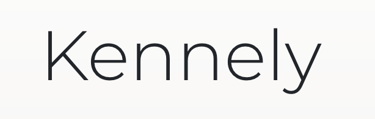

(formerly named Peterest)

### Kennely is a Facebook spinoff for pets. Was originally a Codeup Project but being recreated.

#### The site will allow you to view other peoples' pets and meet other petowners and subscribe to their pet content.

- MySQL for database
- Python (Flask) for backend
- ReactJS / Redux for frontend.

- Backend is Python 3.8.1
- Frontend is React 16.3.1

